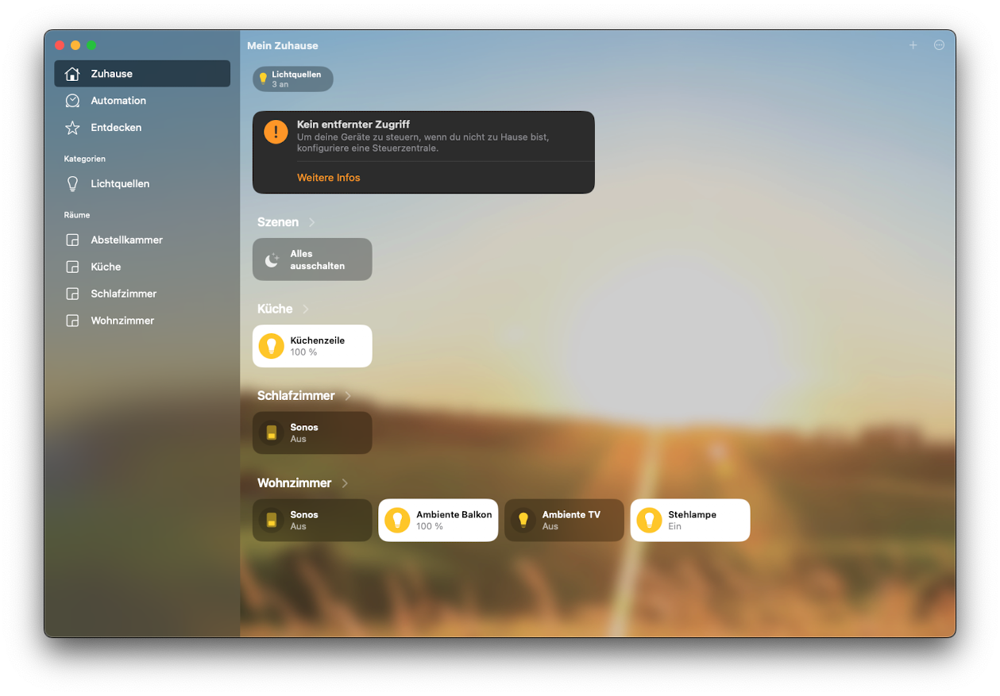

# Home server

This home server stack is deployed on a Dell OptiPlex 7050, running in my storeroom next to the washing machine. It enables my Sonos speakers, TP Link Kasa plugs and IKEA ZigBee light bulbs to be controlled via Apple HomeKit.

The connection to ZigBee devices is done using a [ConBee II USB stick](https://phoscon.de/de/conbee2). To configure it, deCONZ is required. deCONZ brings its own web UI and is connected to Homebridge using the [Homebridge deCONZ plugin](https://github.com/ebaauw/homebridge-deconz).

